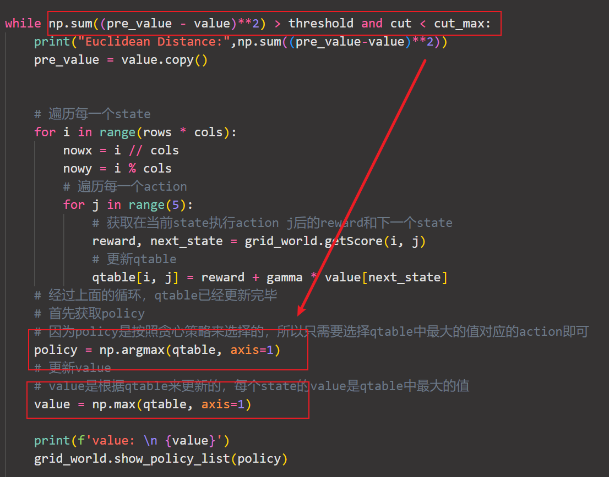
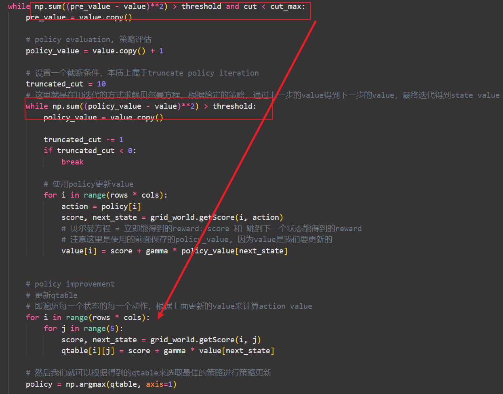

## 总结

通过比较两个算法可以知道：

上面的value算法是下面的policy算法中的一步

但是有一点区别在于：

value iteration是根据初始的value更新一步qtable得到policy和下一个value然后不断迭代。

而policy iteration把上面的当成PE中的一步，通过不断迭代value，再总的更新qtable。

所以他们的关系就是

value iteration 是一步一步更新value 一步一步更新policy

policy iteration 是在PE当中把value迭代很多步更新好了 再更新policy

