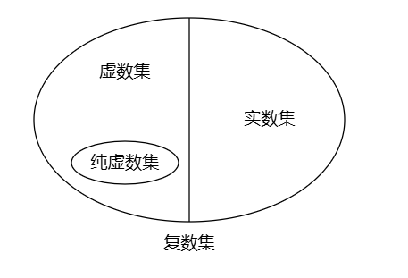
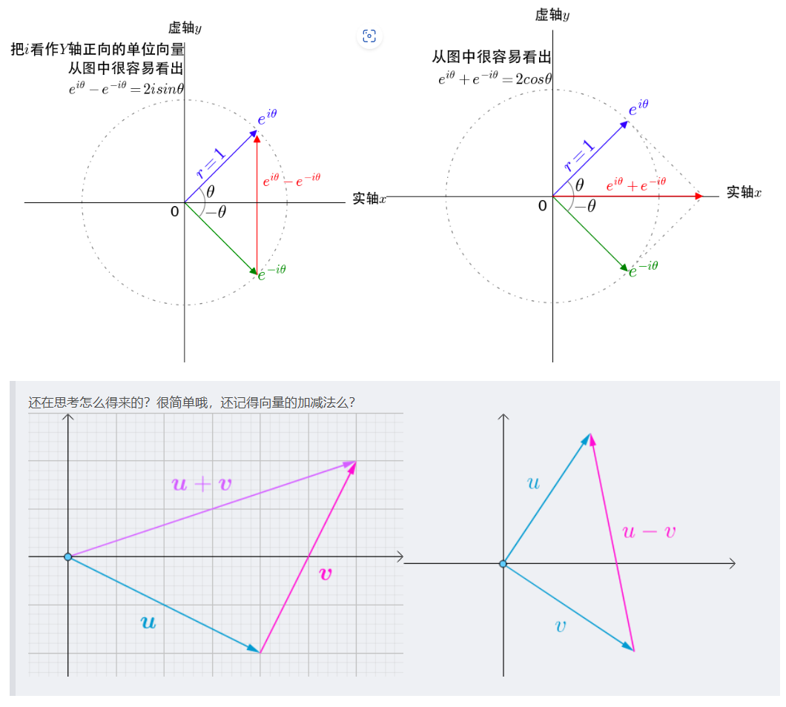
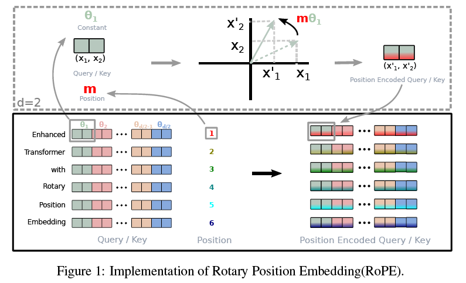

## RoPE (Rotary Position Embedding)

---

**前言**：

1. 本篇文章是关于**语言模型建模过程**当中，将**绝对位置编码**例如经典的**正余弦位置编码**的方法进行改进的**旋转位置编码RoPE (Rotary Position Embedding)**的介绍。

   附上原文：[RoFormer: Enhanced Transformer with Rotary Position Embedding]([[2104.09864\] RoFormer: Enhanced Transformer with Rotary Position Embedding (arxiv.org)](https://arxiv.org/abs/2104.09864))。[RoFormer Github]([ZhuiyiTechnology/roformer: Rotary Transformer (github.com)](https://github.com/ZhuiyiTechnology/roformer))

2. RoPE在大语言模型建模过程当中非常常用，不管是**LLaMA2**还是**蛋白质语言模型ESM2**等。

3. RoPE的好处是一方面不但包含了绝对位置信息，也同时包含了相对位置信息。另一方面，通过增大base的方式可以将上下文建模外推到超长文本。

4. 本文尝试从低门槛的角度，一步一步推导得到RoPE最终的形式。

5. 水平和精力有限，没有介绍绝对位置编码信息和系统的介绍外推和内插的方式（后期会补充，提供了参考资料）。绝对位置编码可以在transformer的notebook里面找到。

6. **有问题非常欢迎找我讨论（可以issue），相互交流学习**！

7. 本文的Github地址：

----

### 1. 数学基础

----

- RoPE的构建离不开复数的知识。

- 理解RoPE推荐以**结果**为导向，即思路是**我要实现这样的位置编码 **-> 什么样的数学形式能够**满足这样的性质**。这里的“这样”均为代指，即推导部分标注⭐的内容。即先完整看完RoPE的作用，反向理解为什么采用复数，这样会更好接受。

---

#### 1.1 复数概念

现有的实数集无法解决${b^2+1} = 0$的解，为了解决这个问题，引入一个新数$i$, 使得$i^2=-1$, 继续用两个实数$a和b$来结合$i$表示所有的复数，即定义：

形如$a + bi, a,b \in \bold{R}$的数称为**复数**，其中$i$被称为**虚数单位**，全体复数的集合叫**复数集**，记作$\bold{C}$。

其中$a$称为复数的**实部**（$Re$），$b$称为复数的**虚部**（$Im$）。

下面是复数集和实数集之间的关系：

#### 1.2 复数的运算

$$\\z_2 = a_2 + ib_2$$

- 加法：

  $$z_1 + z_2 = (a_1 + a_2) + i(b_1 + b_2)$$

- 乘法：

  $$z_1z_2 = (a_1 + ib_1)(a_2 + ib_2) = a_1a_2 + ia_1b_2 + ib_1a_2 + i^2b_1b_2 = (a_1a_2 - b_1b_2) + i(a_1b_2 + b_1a_2)$$

#### 1.3 欧拉公式

欧拉公式是1748年发表的工作，将复数指数函数与三角函数运算巧妙地关联在一起，这也是RoPE的**核心公式**所在：
$$
e^{ix} = \cos{x} + i\sin{x}^{[4]}
$$

#### 1.4 共轭复数

若$z_1 = a_1 + ib_1 , z_2 = a_1 - ib_1$；则成$z_1和z_2$为共轭复数，记：$z_2 = z_1^{*}$，有：

$z*z^{*} = a^2 + b^2 = |z|^2$

#### 1.5 复数和向量

可以把复数当成是向量来处理，复数的实部是$x$方向，虚部是*y*方向，即：

$$[x, y] = x + iy^{[5][6]}$$

从复数坐标系上看用向量表示的复数加减法：

#### 1.6 复数的意义以及和RoPE的关系 (推荐先阅读参考文章5)

读到此处，可能会有点😵。一开始不能理解复数怎么和RoPE联系在一起，为什么要这么做。

可以先阅读一下参考文章5，发现由**一个复数到另一个复数的变换**是由**旋转了一定的角度$\theta$完成**的，这也是旋转位置编码的来源。

至于为什么要采用复数，个人理解还是以结果为导向，正好复数的运算有了⭐这样的性质，所以才采用的复数的运算。

#### 1.7 总结

- *复数 -- 三角函数 -- 向量*的联系需要我们去理解：复数提供了旋转的**概念**，三角函数提供了旋转的**运算**而向量为**矩阵运算**提供了条件。

- 本节对于数学没有过度深究，只介绍了在后文推导过程当中会出现的数学运算，建议可以掌握基本运算后直接看后文的推导，如遇推导不了的步骤，再回头检查数学知识。

#### 1.8 Reference

(1) [线性代数｜向量内积的性质及施瓦茨不等式的证明-CSDN博客](https://blog.csdn.net/Changxing_J/article/details/127180683)

(2) [复数 - OI Wiki (oi-wiki.org)](https://oi-wiki.org/math/complex/)

(3) [线性代数学习笔记8-1：复数矩阵与共轭转置、Hermite矩阵、酉矩阵、傅里叶矩阵和快速傅里叶变换FFT_x·y=y的共轭转置-CSDN博客](https://blog.csdn.net/Insomnia_X/article/details/126569697)

(4) [傻子都能看懂的 —— 详解欧拉公式推导_欧拉公式推导全过程-CSDN博客](https://blog.csdn.net/qq_38890412/article/details/117334679)

(5) [虚数的意义 - 阮一峰的网络日志 (ruanyifeng.com)](https://www.ruanyifeng.com/blog/2012/09/imaginary_number.html)

(6) [一文通透位置编码：从标准位置编码、旋转位置编码RoPE到ALiBi、LLaMA 2 Long(含NTK-aware简介)-CSDN博客](https://blog.csdn.net/v_JULY_v/article/details/134085503)

### 2. 公式推导

#### 2.1  RoPE的目标

RoPE 的目标是找到一个目标函数，从原文章来说是能够满足以下这句话：

⭐ **在显式的嵌入绝对位置编码的情况下，通过self-attention的计算，能够隐式的体现相对位置的关系**⭐。

如果我们用数学的角度来体现这个过程，即：

$$
q_m = f_q(x_m , m)\\
k_n = f_k(x_n , n)
$$
需要注意的是，这里的$\bold q_m$是融合了位置信息之后的，与下文推导过程当中的$q_m$**并不相同！**

我们的目标是找到一个函数能够满足 $\bold q_m $ 和$\bold k_n$ 的点积 ---- self-attention的计算，能够体现出他们之间的相对位置关系，即：

$$
<f_q(x_m , m), f_k(x_n , n)> = g(x_m, x_n, m-n)
$$
**g( )**即是我们要寻找的目标函数。而$ q_m $ 和$k_n$的表达形式也是我们想要寻找的。

#### 2.2  二维情况

先考虑**2维**的情况，先直接给出结论，然后再证明：

$$
f_q(x_m, m) = W_qx_m * e^{im{\theta}} 
$$

$$
f_k(x_n, n) = W_qx_n * e^{in{\theta}}
$$

$$
g(x_m, x_n, m-n) = Re[(W_qx_m)(W_kx_n)^{*}* e^{i(m-n){\theta}}]
$$

##### 2.2.1 先推导$(4)$式

$$ f_q(x_m, m) = W_qx_m * e^{im{\theta}} = q_m * e^{im{\theta}}$$

注意，这里的 $q_m$不是一开始提到的，而是**不带位置信息的qurey向量！**

如果$q_m$是2维，其中：

$$
q_m = \left( \begin{matrix} q_{m}^{(1)} \\ q_{m}^{(2)}\end{matrix}\right)
$$

$$
W_q = \left( \begin{matrix} W_q^{(11)} &W_q^{(12)}\\W_q^{(21)} &W_q^{(22)}\end{matrix}\right)
$$

$x_m$代表数据，$x_m = \left( \begin{matrix} x_{m}^{(1)} \\ x_{m}^{(2)}\end{matrix}\right)$

根据复数指数函数，可以得出：
$$
e^{im{\theta}} = cos(m{\theta}) + isin(m{\theta})
$$
将$(7)(8)(9)代入(4)$， 可以得到：

$$ f_q(x_m, m) = W_qx_m * e^{im{\theta}} =\left( \begin{matrix} q_{m}^{(1)} \\ q_{m}^{(2)}\end{matrix}\right) * e^{im{\theta}} = \left( \begin{matrix} q_{m}^{(1)} \\ q_{m}^{(2)}\end{matrix}\right)(cos(m{\theta}) + isin(m{\theta}))=  \left( \begin{matrix} W_q^{(11)} &W_q^{(12)}\\W_q^{(21)} &W_q^{(22)}\end{matrix}\right) \left( \begin{matrix} x_{m}^{(1)} \\ x_{m}^{(2)}\end{matrix}\right)(cos(m{\theta}) + isin(m{\theta})) $$

看最终的式子有点复杂，先研究倒数第二步得到的式子：

$\left( \begin{matrix} q_{m}^{(1)} \\ q_{m}^{(2)}\end{matrix}\right)$可以使用复数的向量形式表示，即：$\left( \begin{matrix} q_{m}^{(1)} \\ q_{m}^{(2)}\end{matrix}\right) = q_{m}^{(1)} + iq_{m}^{(2)}$

所以，原式可以写成：

$$f_q(x_m, m) = W_qx_m * e^{im{\theta}} = (q_{m}^{(1)} + iq_{m}^{(2)})(cos(m{\theta}) + isin(m{\theta})) $$

$$ = q_{m}^{(1)}cos(m{\theta}) + q_{m}^{(1)}isin(m{\theta}) + iq_{m}^{(2)}cos(m{\theta}) + i^{2}q_{m}^{(2)}sin(m{\theta}) ~~~~~ ,i^{2} = -1$$

$$ = (q_{m}^{(1)}cos(m{\theta}) - q_{m}^{(2)}sin(m{\theta})) + i(q_{m}^{(1)}sin(m{\theta}) + q_{m}^{(2)}cos(m{\theta}))$$

上式，整体来看是一个复数形式，可以表示成向量形式：

$$ = \left( \begin{matrix} q_{m}^{(1)}cos(m{\theta}) - q_{m}^{(2)}sin(m{\theta}) \\ q_{m}^{(1)}sin(m{\theta}) + q_{m}^{(2)}cos(m{\theta})\end{matrix}\right)$$

从向量计算上来看，上式就是一个$q_m$向量乘以一个旋转矩阵，即：

$$ = \left( \begin{matrix} cos(m{\theta}) &-sin(m{\theta}) \\ sin(m{\theta}) & cos(m{\theta})\end{matrix}\right)\left( \begin{matrix} q_{m}^{(1)} \\ q_{m}^{(2)}\end{matrix}\right)$$

即：
$$
f_q(x_m, m) = \left( \begin{matrix} cos(m{\theta}) &-sin(m{\theta}) \\ sin(m{\theta}) & cos(m{\theta})\end{matrix}\right)\left( \begin{matrix} q_{m}^{(1)} \\ q_{m}^{(2)}\end{matrix}\right)
$$
以此同理，我们可以得到：

$$
f_k(x_n, n) = \left( \begin{matrix} cos(n{\theta}) &-sin(n{\theta}) \\ sin(n{\theta}) & cos(n{\theta})\end{matrix}\right)\left( \begin{matrix} k_{n}^{(1)} \\ k_{n}^{(2)}\end{matrix}\right)
$$

##### 2.2.2 再推导$(6)式$

采用**双向推导**的方式：

首先，最开始给出的结论中，$Re[x]$代表复数$x$的实部，$(W_kx_n)^{*}$表示该复数的共轭复数：

$$Re[(W_qx_m)(W_kx_n)^{*}* e^{i(m-n){\theta}}]$$

其中：

$$W_qx_m = q_m = \left( \begin{matrix} q_{m}^{(1)} \\ q_{m}^{(2)}\end{matrix}\right) = q_{m}^{(1)} + iq_{m}^{(2)}$$

$$W_kx_n = k_n = \left( \begin{matrix} k_{n}^{(1)} \\ k_{n}^{(2)}\end{matrix}\right) = k_{n}^{(1)} + ik_{n}^{(2)}$$

$$(W_kx_n)^{*} = k_n^{*} = k_{n}^{(1)} - ik_{n}^{(2)}$$

$$ e^{i(m-n){\theta}} = cos((m-n){\theta}) + isin((m-n){\theta})$$

可以得到：

$$Re[(W_qx_m)(W_kx_n)^{*}* e^{i(m-n){\theta}}] = Re[(q_{m}^{(1)} + iq_{m}^{(2)})(k_{n}^{(1)} - ik_{n}^{(2)})(cos((m-n){\theta}) + isin((m-n){\theta}))]$$

$$ = Re[((q_{m}^{(1)}k_{n}^{(1)} - q_{m}^{(2)}k_{n}^{(2)})  + i(q_{m}^{(2)}k_{n}^{(1)} - q_{m}^{(1)}k_{n}^{(2)}))(cos((m-n){\theta}) + isin((m-n){\theta}))]$$

$$ = ((q_{m}^{(1)}k_{n}^{(1)} - q_{m}^{(2)}k_{n}^{(2)})(cos((m-n){\theta})  - (q_{m}^{(2)}k_{n}^{(1)} - q_{m}^{(1)}k_{n}^{(2)})sin((m-n){\theta})$$

即：
$$
Re[(W_qx_m)(W_kx_n)^{*}* e^{i(m-n){\theta}}] =
((q_{m}^{(1)}k_{n}^{(1)} - q_{m}^{(2)}k_{n}^{(2)})(cos((m-n){\theta})  - (q_{m}^{(2)}k_{n}^{(1)} - q_{m}^{(1)}k_{n}^{(2)})sin((m-n){\theta}) \tag{2.2.2.1}
$$
其次，我们从最开始给出的结论的左边，也就是$ f_q(x_m, m)$和$f_k(x_n, n)$在计算attention的时候要计算内积开始推导, 根据前面的推导：

$$<f_q(x_m, m),f_k(x_n, n)> = \left( \begin{matrix} q_{m}^{(1)}cos(m{\theta}) - q_{m}^{(2)}sin(m{\theta}) \\ q_{m}^{(1)}sin(m{\theta}) + q_{m}^{(2)}cos(m{\theta})\end{matrix}\right)\left( \begin{matrix} k_{n}^{(1)}cos(n{\theta}) - k_{n}^{(2)}sin(n{\theta}) \\ k_{n}^{(1)}sin(n{\theta}) + k_{n}^{(2)}cos(n{\theta})\end{matrix}\right)$$

 $$ = (q_{m}^{(1)}cos(m{\theta}) - q_{m}^{(2)}sin(m{\theta}))(k_{n}^{(1)}cos(n{\theta}) - k_{n}^{(2)}sin(n{\theta})) + (q_{m}^{(1)}sin(m{\theta}) + q_{m}^{(2)}cos(m{\theta}))(k_{n}^{(1)}sin(n{\theta}) + k_{n}^{(2)}cos(n{\theta}))$$

 $$ = q_{m}^{(1)}cos(m{\theta})k_{n}^{(1)}cos(n{\theta}) - q_{m}^{(2)}sin(m{\theta})k_{n}^{(1)}cos(n{\theta}) - q_{m}^{(1)}cos(m{\theta})k_{n}^{(2)}sin(n{\theta}) + q_{m}^{(2)}sin(m{\theta})k_{n}^{(2)}sin(n{\theta})$$

$$ + q_{m}^{(1)}sin(m{\theta})k_{n}^{(1)}sin(n{\theta}) + q_{m}^{(2)}cos(m{\theta})k_{n}^{(1)}sin(n{\theta}) + q_{m}^{(1)}sin(m{\theta})k_{n}^{(2)}cos(n{\theta}) + q_{m}^{(2)}cos(m{\theta})k_{n}^{(2)}cos(n{\theta})$$

合并同类项，把三角函数相同的项合并在一起，例如第一项和第八项，总共分成四组：

$$ = q_{m}^{(1)}cos(m{\theta})k_{n}^{(1)}cos(n{\theta}) + q_{m}^{(2)}cos(m{\theta})k_{n}^{(2)}cos(n{\theta}) $$

$$ - q_{m}^{(2)}sin(m{\theta})k_{n}^{(1)}cos(n{\theta}) + q_{m}^{(1)}sin(m{\theta})k_{n}^{(2)}cos(n{\theta}) $$

$$ - q_{m}^{(1)}cos(m{\theta})k_{n}^{(2)}sin(n{\theta}) + q_{m}^{(2)}cos(m{\theta})k_{n}^{(1)}sin(n{\theta}) $$

$$ + q_{m}^{(2)}sin(m{\theta})k_{n}^{(2)}sin(n{\theta}) + q_{m}^{(1)}sin(m{\theta})k_{n}^{(1)}sin(n{\theta}) $$

$$ = (q_{m}^{(1)}k_{n}^{(1)} + q_{m}^{(2)}k_{n}^{(2)})cos(m{\theta})cos(n{\theta}) $$

$$ - (q_{m}^{(2)}k_{n}^{(1)} - q_{m}^{(1)}k_{n}^{(2)})sin(m{\theta})cos(n{\theta}) $$

$$ - (q_{m}^{(1)}k_{n}^{(2)} - q_{m}^{(2)}k_{n}^{(1)})cos(m{\theta})sin(n{\theta})$$

$$ + (q_{m}^{(2)}k_{n}^{(2)} + q_{m}^{(1)}k_{n}^{(1)})sin(m{\theta})sin(n{\theta}) $$

根据三角函数的和差化积公式， 例：

$$sin(a+b) = sinacosb + sinbcosa$$

可以得到上式：

$$
(q_{m}^{(2)}k_{n}^{(2)} + q_{m}^{(1)}k_{n}^{(1)})(cos(m-n){\theta}) - (q_{m}^{(2)}k_{n}^{(1)} - q_{m}^{(1)}k_{n}^{(2)})(sin(m-n){\theta}) \tag{2.2.2.2}
$$
可以发现此时得到$(2.2.2.2)式和(2.2.2.1)$是**一致**的，**因此，我们最开始给出的证明是正确的。**

##### 2.2.3 向量形式

更多的，我们可以用上面推导的旋转向量公式将结果用向量表示出来：

$$ f_q(x_m, m) = \left( \begin{matrix} cos(m{\theta}) &-sin(m{\theta}) \\ sin(m{\theta}) & cos(m{\theta})\end{matrix}\right)\left( \begin{matrix} q_{m}^{(1)} \\ q_{m}^{(2)}\end{matrix}\right)$$

$$ f_k(x_n, n) = \left( \begin{matrix} cos(n{\theta}) &-sin(n{\theta}) \\ sin(n{\theta}) & cos(n{\theta})\end{matrix}\right)\left( \begin{matrix} k_{n}^{(1)} \\ k_{n}^{(2)}\end{matrix}\right)$$

$$<f_q(x_m, m),f_k(x_n, n)> = \left( \begin{matrix} cos(m{\theta}) &-sin(m{\theta}) \\ sin(m{\theta}) & cos(m{\theta})\end{matrix}\right)\left( \begin{matrix} q_{m}^{(1)} \\ q_{m}^{(2)}\end{matrix}\right)\left( \begin{matrix} cos(n{\theta}) &-sin(n{\theta}) \\ sin(n{\theta}) & cos(n{\theta})\end{matrix}\right)\left( \begin{matrix} k_{n}^{(1)} \\ k_{n}^{(2)}\end{matrix}\right)$$

$$= \left( \begin{matrix} q_{m}^{(1)} \\ q_{m}^{(2)}\end{matrix}\right)\left( \begin{matrix} k_{n}^{(1)} \\ k_{n}^{(2)}\end{matrix}\right)\left( \begin{matrix} cos(m{\theta}) &-sin(m{\theta}) \\ sin(m{\theta}) & cos(m{\theta})\end{matrix}\right)\left( \begin{matrix} cos(n{\theta}) &-sin(n{\theta}) \\ sin(n{\theta}) & cos(n{\theta})\end{matrix}\right)$$

在计算时，需要将q，k转置来满足矩阵乘法， 再对后面的两个式子化简：

$$= \left( \begin{matrix} q_{m}^{(1)} ~~ q_{m}^{(2)}\end{matrix}\right)\left( \begin{matrix} k_{n}^{(1)} \\ k_{n}^{(2)}\end{matrix}\right)\left( \begin{matrix} cos(m{\theta}) &sin(m{\theta}) \\ -sin(m{\theta}) & cos(m{\theta})\end{matrix}\right)\left( \begin{matrix} cos(n{\theta}) &-sin(n{\theta}) \\ sin(n{\theta}) & cos(n{\theta})\end{matrix}\right)$$

$$= \left( \begin{matrix} q_{m}^{(1)} ~~ q_{m}^{(2)}\end{matrix}\right)\left( \begin{matrix} k_{n}^{(1)} \\ k_{n}^{(2)}\end{matrix}\right)\left( \begin{matrix} cos(m{\theta})cos(n{\theta})+ sin(n{\theta})sin(m{\theta})&-cos(m{\theta})sin(n{\theta})+ sin(m{\theta})cos(n{\theta})\\ -sin(m{\theta})cos(n{\theta})+cos(m{\theta})sin(n{\theta}) & sin(m{\theta})sin(n{\theta})+cos(m{\theta})cos(n{\theta})\end{matrix}\right)$$

根据三角函数和差化积公式：

$$= \left( \begin{matrix} q_{m}^{(1)} ~~ q_{m}^{(2)}\end{matrix}\right)\left( \begin{matrix} k_{n}^{(1)} \\ k_{n}^{(2)}\end{matrix}\right)\left( \begin{matrix} cos((m-n){\theta})&-sin((m-n){\theta})\\ sin((m-n){\theta}) & cos((m-n){\theta})\end{matrix}\right)$$

即：
$$
<f_q(x_m, m),f_k(x_n, n)> = \left( \begin{matrix} q_{m}^{(1)} ~~ q_{m}^{(2)}\end{matrix}\right)\left( \begin{matrix} k_{n}^{(1)} \\ k_{n}^{(2)}\end{matrix}\right)\left( \begin{matrix} cos((m-n){\theta})&-sin((m-n){\theta})\\ sin((m-n){\theta}) & cos((m-n){\theta})\end{matrix}\right)
$$
以$(12)式看q,k向量乘积的结果：很清晰的体现了相对位置的关系$

#### 2.3 多维情况

需要将二维的情况扩展到多维上：

对于二维的情况来说，我们观察变换$q$和$k$的函数：

$$ f_q(x_m, m) = \left( \begin{matrix} cos(m{\theta}) &-sin(m{\theta}) \\ sin(m{\theta}) & cos(m{\theta})\end{matrix}\right)\left( \begin{matrix} q_{m}^{(1)} \\ q_{m}^{(2)}\end{matrix}\right)$$

$q_{m}^{(1)}$和$q_{m}^{(2)}$是$q$向量的$m$位置的第一维和第二维，上面这个变化的几何意义，就是对向量$(q_{m}^{(1)},q_{m}^{(2)})$进行了旋转。

将此方法应用到高维，可以让$m$位置的维度，两两一组，应用以上变换，例，四维：

1-2维：

$$ f_q(x_m^{(1-2)}, m) = \left( \begin{matrix} cos(m{\theta}_{0}) &-sin(m{\theta}_{0}) \\ sin(m{\theta}_{0}) & cos(m{\theta}_{0})\end{matrix}\right)\left( \begin{matrix} q_{m}^{(1)} \\ q_{m}^{(2)}\end{matrix}\right)$$

3-4维：

$$ f_q(x_m^{(3-4)}, m) = \left( \begin{matrix} cos(m{\theta}_{1}) &-sin(m{\theta}_{1}) \\ sin(m{\theta}_{1}) & cos(m{\theta}_{1})\end{matrix}\right)\left( \begin{matrix} q_{m}^{(3)} \\ q_{m}^{(4)}\end{matrix}\right)$$

可以将上面的两个结果通过一个稀疏的大矩阵合并在一起（内积的线性叠加）：

1-4维：

$$ f_q(x_m^{(1-4)}, m) = \left( \begin{matrix} cos(m{\theta}_{0}) &-sin(m{\theta}_{0}) &0&0\\ sin(m{\theta}_{0}) & cos(m{\theta}_{0})&0&0 \\0&0 &cos(m{\theta}_{1}) &-sin(m{\theta}_{1})\\ 0&0&sin(m{\theta}_{1}) & cos(m{\theta}_{1})\end{matrix}\right)\left( \begin{matrix} q_{m}^{(1)} \\ q_{m}^{(2)}\\q_{m}^{(3)}\\q_{m}^{(4)}\end{matrix}\right)$$

由此看出，可以利用以上形式对$m \in \bold{R}^{d}$的情况进行描述：
$$
f_q(x_m^{(d)}, m) = \left( \begin{matrix} cos(m{\theta}_{0}) &-sin(m{\theta}_{0}) &0&0 &\cdots &0&0\\ sin(m{\theta}_{0}) & cos(m{\theta}_{0})&0&0 &\cdots &0&0\\0&0 &cos(m{\theta}_{1}) &-sin(m{\theta}_{1})&\cdots &0&0\\ 0&0&sin(m{\theta}_{1}) & cos(m{\theta}_{1})&\cdots &0&0 \\ \vdots &\vdots&\vdots&\vdots&\ddots&\vdots&\vdots\\0&0&0&0&\cdots&cos(m{\theta}_{\frac{d}{2}})&-sin(m{\theta}_{\frac{d}{2}})\\0&0&0&0&\cdots&sin(m{\theta}_{\frac{d}{2}})&cos(m{\theta}_{\frac{d}{2}})\end{matrix}\right)\left( \begin{matrix} q_{m}^{(0)} \\ q_{m}^{(1)}\\q_{m}^{(2)}\\q_{m}^{(3)}\\ \vdots \\ q_{m}^{(d-2)} \\q_{m}^{(d-1)} \end{matrix}\right)
$$
需要注意的是这里的维度为了和正常程序中保持一致，**改成从索引0**开始了，即第一维的索引是0。

这里的$\theta$是偏转角度的意思，它的大小和维度有关：
$$
\Theta = \lbrace \theta_{i} = 10000^{-2(i-1)/d}, i \in [1,2,...d/2]\rbrace
$$
上式的$i$是第$i$维，$d$是总维度数，$\theta_{i}$是偏转的角度。

由于上面的矩阵是非常稀疏的，计算的时候会采用逐位相乘再相加的方式进行计算：
$$
f_q(x_m^{(d)}, m) = \left[\begin{matrix} q_{m}^{(0)} \\ q_{m}^{(1)}\\q_{m}^{(2)}\\q_{m}^{(3)}\\ \vdots \\ q_{m}^{(d-2)} \\q_{m}^{(d-1)} \end{matrix}\right] \bigotimes \left[\begin{matrix} cos(m{\theta}_{0}) \\ cos(m{\theta}_{0})\\cos(m{\theta}_{1})\\cos(m{\theta}_{1})\\ \vdots \\ cos(m{\theta}_{\frac{d}{2}}) \\cos(m{\theta}_{\frac{d}{2}}) \end{matrix}\right] + \left[\begin{matrix} -q_{m}^{(1)} \\ q_{m}^{(0)}\\-q_{m}^{(3)}\\q_{m}^{(2)}\\ \vdots \\ -q_{m}^{(d-1)} \\q_{m}^{(d-2)} \end{matrix}\right] \bigotimes \left[\begin{matrix} sin(m{\theta}_{0}) \\ sin(m{\theta}_{0})\\sin(m{\theta}_{1})\\sin(m{\theta}_{1})\\ \vdots \\ sin(m{\theta}_{\frac{d}{2}}) \\sin(m{\theta}_{\frac{d}{2}}) \end{matrix}\right]
$$

#### 2.4 计算流程

总览

第一步：计算出token序列的query和key向量，（图的左下）。

第二步：对于每个token即左下的`Enhanced`等，取该token的embedding向量的两两维度为一组，应用旋转位置编码 （图的上半）。

第三步：按照每个token的两个维度两两一组，组成Position Encoded Query / Key （图的右下）。

第四步：对变换过的Query和Key计算self-attention。(未在图中)

通过第四步计算后，按照上面对二维情况的推导（多维未写出）即可得到相对的位置编码信息，即我们通过角度的绝对位置编码，通过self-attention的计算，得到了相对位置编码的信息。

#### 2.5 Reference

(1) [一文通透位置编码：从标准位置编码、旋转位置编码RoPE到ALiBi、LLaMA 2 Long(含NTK-aware简介)-CSDN博客](https://blog.csdn.net/v_JULY_v/article/details/134085503)

(2) [线性代数——向量的内积、范数、正交，向量组的线性相关性和向量空间_验证函数系关于内积正交,并求范数-CSDN博客](https://blog.csdn.net/SakuraHimi/article/details/106344626)

(3) [Transformer升级之路：2、博采众长的旋转式位置编码 - 科学空间|Scientific Spaces (kexue.fm)](https://kexue.fm/archives/8265)

(4) [LLM学习记录（五）--超简单的RoPE理解方式 - 知乎 (zhihu.com)](https://zhuanlan.zhihu.com/p/642289220)

### 3. RoPE的外推和内插 (推荐阅读参考资料2)

#### Reference

(1) [最强LLaMA突然来袭！只改一个超参数，实现上下文3.2万token，多个任务打败ChatGPT、Claude 2 (qq.com)](https://mp.weixin.qq.com/s?__biz=MzIzNjc1NzUzMw==&mid=2247697635&idx=1&sn=9cdb5237077dbc4500856ef1d02c9464&chksm=e8df7391dfa8fa87fa014ba09deffc81b7ccf64ce68bd3b6ef39b9eced9e157a066651cddef5&mpshare=1&scene=23&srcid=09301p6Q6O51wRLPlYryhkVJ&sharer_shareinfo=3c6f02f7dd69fe81e8114949c8cc0feb&sharer_shareinfo_first=dd23961fd33178f3f5fff3d6324d4593#rd)

(2) [【手撕LLM-NTK RoPE】长文本“高频外推、低频内插“从衰减性视角理解 - 知乎 (zhihu.com)](https://zhuanlan.zhihu.com/p/702964625)

(3) [【手撕LLM】长文本的Position Encoding的衰减性证明 - 知乎 (zhihu.com)](https://zhuanlan.zhihu.com/p/709234529)