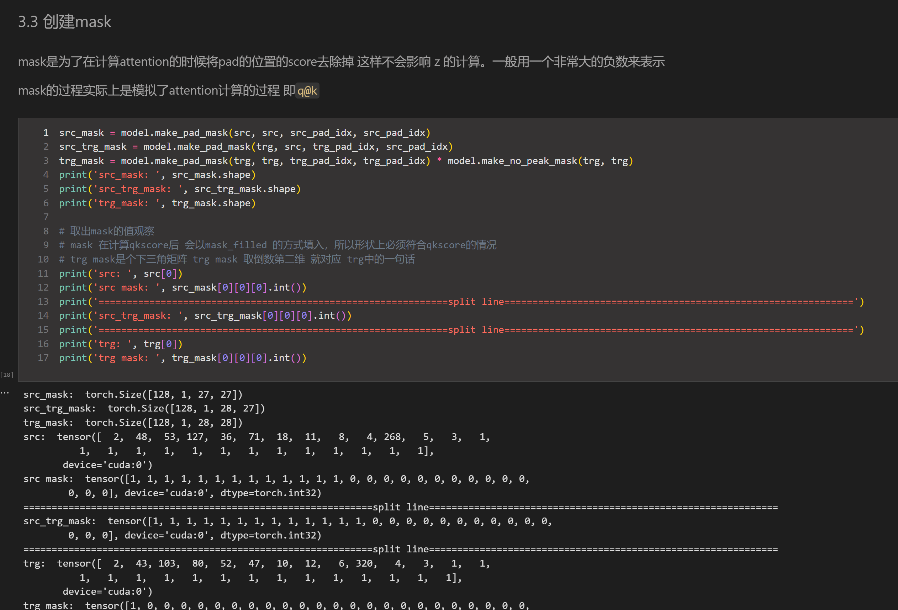
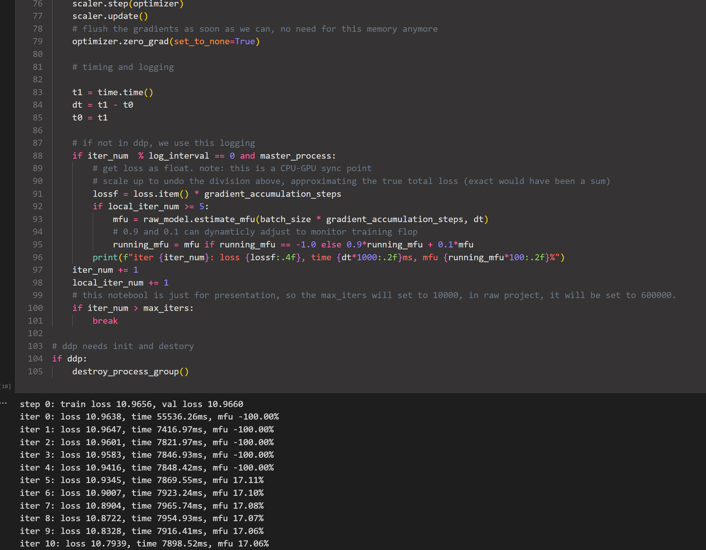
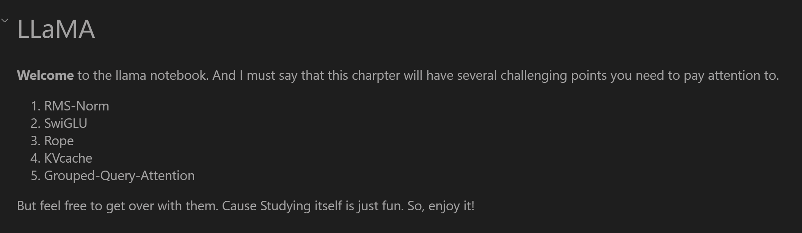

# FLLMB
**F**or **L**arge **L**anguage **M**odel **B**eginners

## Discription
This is the repetory of reproducing several llm models notebook.

## What is New?
- The tutorial aims to reproduce llms in one notebook. And not only just the model architecture, but also training and inference process.

- It means that you will see three parts in the notebook: 
    - Model Architectures: modules and ensembles
    - Model Debug: debug the message passing through each layer and each method
    - Training and inference: some models may not update inference process, but it would be completed very soon. 

- Feel free to give suggestions and feedbacks!
---
## Content
- [x] transformer
- [x] GPT-2
- [x] LLaMA
- [ ] ReinforcementLearning
    - [x] value iteration and policy iteration
    - [x] Monte Carlo Algorithms
    - [ ] SGD
---
## Addition
- [x] RoPE
- [x] BPE-Tokenizer
- [x] LoRA (in llama notebook)
  
## Schema
-  **Transformer** 

-  **GPT**  

-  **LLaMA**  

